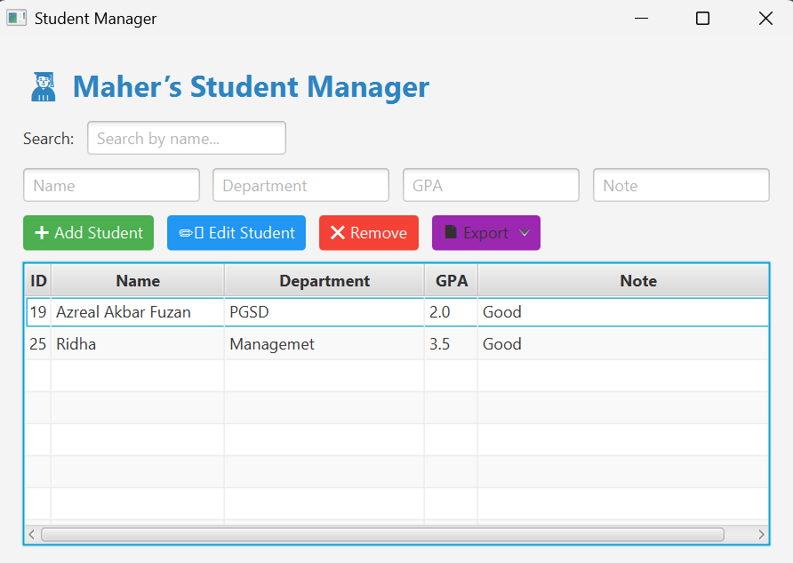

# 🎓 Student Manager App (JavaFX + MySQL)

A modern desktop application to manage student records — built with JavaFX and MySQL. This project supports adding, editing, deleting, searching, and exporting student data.


---

## ✨ Features

- ✅ Add, edit, and delete students
- 🔍 Search students by name or department
- 📄 Export data to CSV and PNG
- 📊 Real-time table view
- 💾 MySQL database integration
- 🧠 Organized using MVC pattern

---

## 🛠 Technologies Used

| Layer       | Tech Stack                     |
|-------------|--------------------------------|
| Frontend    | JavaFX, FXML                   |
| Backend     | Java (JDK 17+)                 |
| Database    | MySQL (phpMyAdmin friendly)    |
| Tools       | IntelliJ IDEA, Git, JDBC       |

---

## 📂 Project Structure

```
src/
 └── main/
     └── java/
         └── com.example.studentmanager/
             ├── HelloController.java
             ├── Student.java
             ├── StudentDAO.java
             ├── StudentRepository.java
             └── HelloApplication.java
     └── resources/
         └── hello-view.fxml
```

---

## 🧪 Database Setup

1. Create a database named: `student_manager`
2. Run this SQL:

```sql
CREATE TABLE students (
  student_id INT AUTO_INCREMENT PRIMARY KEY,
  name VARCHAR(100),
  department VARCHAR(100),
  gpa DOUBLE,
  note TEXT
);
```

3. Update your database credentials in `HelloController.java` if needed:

```java
private final String DB_URL = "jdbc:mysql://localhost:3306/student_manager";
private final String DB_USER = "root";
private final String DB_PASS = "";
```

---

## 🚀 How to Run

1. Clone the project:
   ```bash
   git clone https://github.com/Maher-Codes/Student-Manager-Project.git
   cd Student-Manager-Project
   ```

2. Open it in **IntelliJ IDEA**

3. Make sure you have:
   - JavaFX SDK added
   - MySQL Server running
   - Database `student_manager` with `students` table created

4. Run `HelloApplication.java` to launch the app!

---

## 🖼️ Export Features

- **CSV Export**: Saves all records to a `.csv` file
- **PNG Export**: Takes a snapshot of the table and saves it as an image

---

## 📸 Screenshots (Optional)



---

## 🤝 Contributors

- Built with ❤️ by [Maher](https://github.com/Maher-Codes)

---

## 📃 License

This project is open-source and available under the [MIT License](LICENSE).